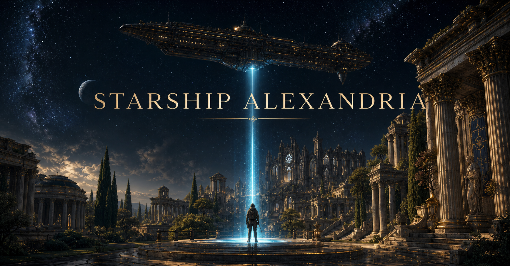
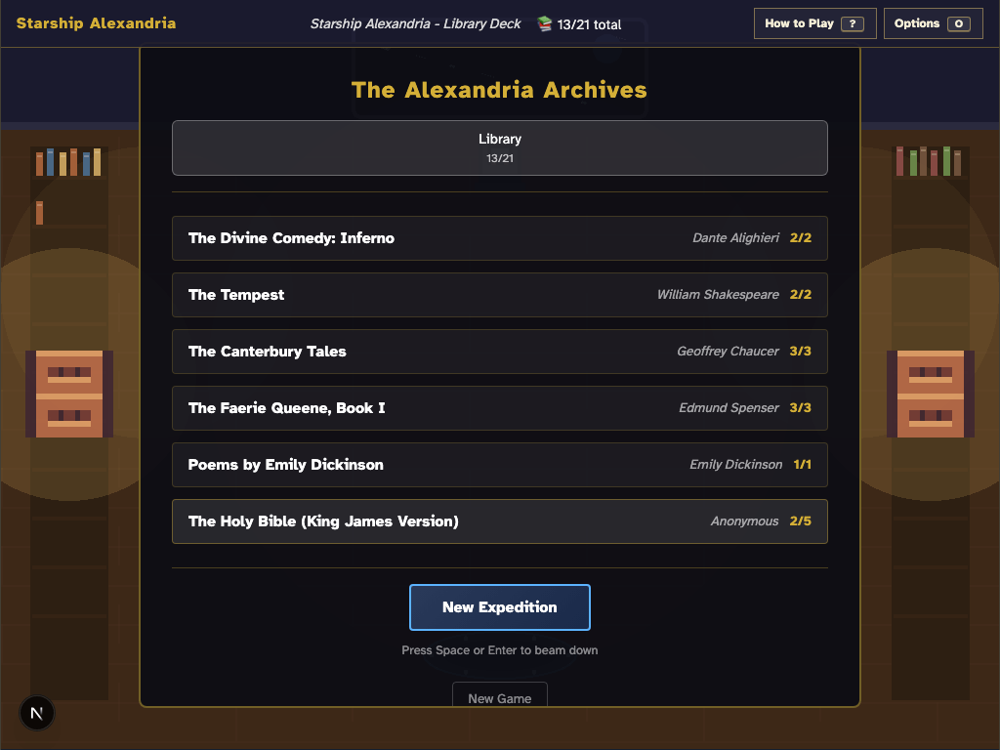
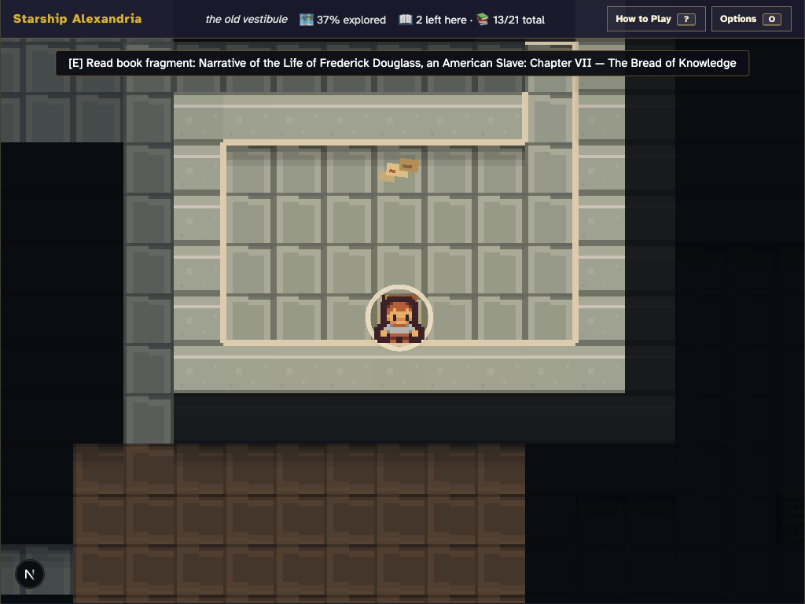
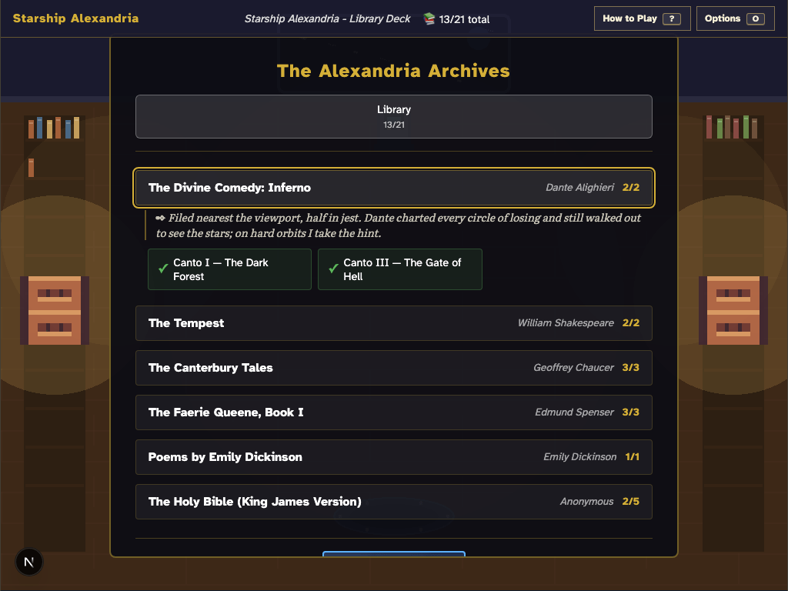
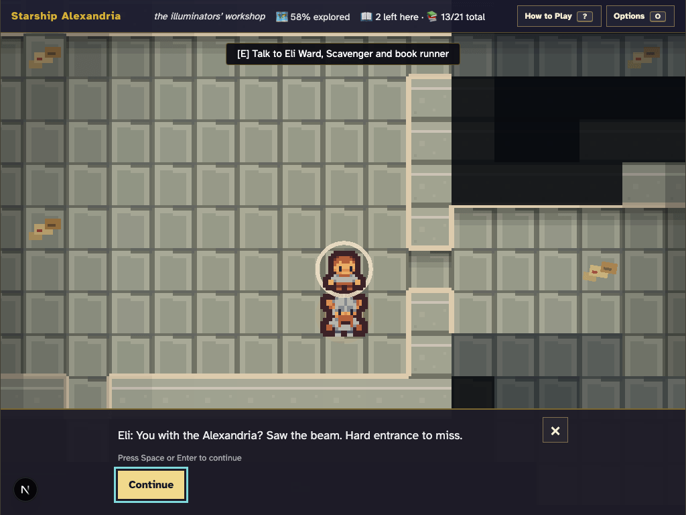

# Starship Alexandria

[](https://github.com/sethwilsonUS/starship-alexandria/actions/workflows/ci.yml)


[](LICENSE)

A quiet, keyboard-first roguelike about recovering lost literature from the ruins of Earth.

From the orbiting library ship *Alexandria*, choose a recovery signal, beam down, explore a procedurally generated archive, meet its survivors, follow a vault clue, and bring public-domain writing home. There is no combat, player death, or timer—only exploration, discovery, and the words that endure.

[Play the live demo](https://starship-alexandria.vercel.app)



*AI-generated “Celestial Acropolis” key art for Starship Alexandria; the same composition supplies the social-preview crop. Generation details are recorded in the [image manifest](public/images/manifest.json).*

## Screenshots

| Aboard the Alexandria | On the surface |
| --- | --- |
|  |  |
|  |  |

## What is in the game

- Four destinations with different map structures, tiles, room vocabularies, NPC pools, and vault stories.
- Twenty-one sourced excerpts across ten public-domain works, including *Paradise Lost*, *The Canterbury Tales*, *The Faerie Queene*, *Frankenstein*, *A Vindication of the Rights of Woman*, and Frederick Douglass's *Narrative*.
- Deterministic expeditions: a seed reproduces the layout, placements, clue, and reward; the active seed is shown in Options and on the area map so runs can be shared.
- A nonviolent collection loop with a lantern-soft fog of war, journals, maps, NPC dialogue, clue-driven vaults that never require code entry, and a browsable ship library.
- A lived-in library deck whose shelves visibly fill with recovered book spines, plus a transporter cinematic in both directions and a generative ambient music bed with its own Options toggle.
- Eight survivors with distinct recorded first-meeting voices, dialogue that reacts once the vault clue is in hand, an archivist's note for every recovered work, and an epilogue that ends the completed archive on the recovered words themselves.
- Accessible HTML for first-run instructions, persistent options, dialogue, reading, maps, and mission selection around a focused Phaser game region.
- A reusable How to Play guide with deterministic prerecorded narration, plus sound-effects, ambience, music, volume, and motion preferences available from both ship and surface. Audio never starts without the player's gesture.
- Visible game-event announcements and a textual map equivalent for information that would otherwise exist only on the canvas.
- A small versioned local save that preserves progress and preferences while safely returning every reload to the ship.

## Destinations

| Destination | Topology | Notable spaces | Vault thread |
| --- | --- | --- | --- |
| The Ruined Scriptorium | rot.js Digger rooms and corridors | chained stacks, reading room, refectory, manuscript workshop | catalog card and archive safe |
| Cathedral of the Last Canticle | custom ruined cross-plan | nave, transepts, chapels, cloister, crypt | annotated hymnal and reliquary |
| The Shattered Collegium | academic rooms around a courtyard loop | lecture hall, laboratory, dormitory, special collections | registrar memo and lockbox |
| The Overgrown Athenaeum | cellular clearings connected by paths | conservatory, sculpture garden, flooded pavilion, seed bank | greenhouse log and seed cache |

“Surprise Me” selects from the same registry and avoids immediately repeating the previous destination.

## Controls

The game targets desktop keyboard play. Native controls inside dialogs continue to use their standard browser behavior.

| Key | Action |
| --- | --- |
| Arrow keys or `W` `A` `S` `D` | Move one tile while exploring |
| `Space` or `E` | Interact with the adjacent object or person |
| `Space` or `Enter` | Advance dialogue; open the destination picker from the ship |
| `M` | Open or close the recovered area map |
| `I` | Hear/read a concise status summary |
| `?` | Open How to Play during normal play |
| `O` | Open Options during normal play |
| `Escape` | Close the active HTML overlay |
| `Tab` / `Shift`+`Tab` | Move through HTML controls and dialog actions |

## Run locally

Prerequisites: Node.js 22 (the exact version is in [`.nvmrc`](.nvmrc)) and npm.

```bash
git clone https://github.com/sethwilsonUS/starship-alexandria.git
cd starship-alexandria
nvm use
npm ci
npm run dev
```

Open [http://localhost:8080](http://localhost:8080).

### Useful commands

| Command | Purpose |
| --- | --- |
| `npm run dev` | Start the Next.js development server on port 8080 |
| `npm run check` | Run content/assets validation, lint, typecheck, tests, and a production build |
| `npm test` | Run the Vitest unit and integration suite once |
| `npm run test:watch` | Run Vitest in watch mode |
| `npm run test:e2e` | Run the Playwright browser suite |
| `npm run test:e2e:update` | Intentionally refresh Playwright visual baselines |
| `npm run generate:social-preview` | Rebuild the 1200×630 social card from the README key art |
| `npm run generate-voices:how-to-play` | Regenerate the committed How to Play narration with OpenAI TTS |
| `npm run smoke` | Run the representative browser smoke journey |
| `npm run lint` | Check source files with ESLint |
| `npm run typecheck` | Run strict TypeScript checks without emitting files |
| `npm run validate-content` | Validate YAML, text paths, metadata, theme references, and catalog invariants |
| `npm run validate-assets` | Verify local runtime assets, hashes, formats, dimensions, and licenses |
| `npm run build` | Validate content and create a production Next.js build |
| `npm run refresh-assets` | Rebuild committed runtime assets from pinned maintainer sources |

For the full local quality gate, run `npm run check`.

To smoke-test a deployed build, set `PLAYWRIGHT_BASE_URL` before `npm run smoke`.
Protected Vercel previews are supported through either
`VERCEL_AUTOMATION_BYPASS_SECRET` or a short-lived `VERCEL_OIDC_TOKEN`; neither
credential is stored in the repository.

## How it is built

Starship Alexandria uses Next.js 16 and React 19 for the application shell and accessible HTML overlays, Phaser 4 for the 1024×768 game world, Zustand 5 for progression/settings/modal state, and rot.js for selected topology builders. The procedural generator is a synchronous, Phaser-free TypeScript module whose semantic output is adapted for rendering.

The ownership rule is intentionally sharp:

- React owns documents, dialogs, focus, tabs, reading, settings, and screen-reader-facing equivalents.
- Phaser owns world rendering, visibility, collision presentation, movement effects, and spatial sound.
- Zustand owns durable progression and transient UI/game state.
- The typed event bridge carries commands and events between React and Phaser.

See [Architecture](docs/ARCHITECTURE.md) for the generator contract, state boundaries, save model, and test strategy.

## Repository map

```text
public/
├── audio/voices/            # Committed prerecorded narration and disclosure manifest
├── content/                 # Sole source for narrative data and excerpt text
├── game-assets/             # Committed local tiles, sprites, audio, and provenance manifest
└── fonts/                   # Self-hosted OFL interface and reading fonts
src/
├── app/                     # Next.js App Router entry points and metadata
├── components/              # Accessible React overlays and game shell
├── game/
│   ├── expeditions/         # Pure theme registry, layouts, RNG, generator, and adapter
│   ├── player/              # Pure movement and interaction contracts
│   ├── scenes/              # Phaser boot, ship, and expedition scenes
│   ├── systems/             # FOV, movement, placement, effects, and announcements
│   └── EventBridge.ts       # Typed React ↔ Phaser boundary
├── store/                   # Zustand state and save-v7 migration
├── data/                    # Typed catalog adapters
├── types/                   # Shared application/content contracts
└── utils/                   # Content loading, narration, and focused helpers
scripts/                     # Content and asset maintenance tools
docs/                        # Architecture and authoring guides
```

## Authoring and contribution guides

- [Architecture](docs/ARCHITECTURE.md)
- [Content authoring](docs/CONTENT_AUTHORING.md)
- [Destination theme authoring](docs/THEME_AUTHORING.md)
- [Contributing](CONTRIBUTING.md)
- [Asset credits and licenses](ASSET_CREDITS.md)
- [Runtime asset provenance](public/game-assets/README.md)

`public/content/` is the only runtime content source. The legacy root `content/` tree is intentionally rejected by validation so the browser, tests, and editing docs cannot silently drift apart.

## Literature, media, and licenses

Project code is available under the [MIT License](LICENSE). Bundled literature is separate from the code license: each work records its Project Gutenberg eBook number, edition, source URL, source location, and “Public domain in the USA” notice in [`public/content/books.yaml`](public/content/books.yaml).

Runtime game art and sound are local—there are no remote runtime asset requests. The bundle uses compatible CC0 sources, primarily Kenney and OpenGameArt contributors, with human-readable credits in [`ASSET_CREDITS.md`](ASSET_CREDITS.md) and hashes/transformations in [`public/game-assets/manifest.json`](public/game-assets/manifest.json). Atkinson Hyperlegible and Literata are self-hosted under the SIL Open Font License; their license files ship beside the fonts.

How to Play uses a committed OpenAI-generated `marin` recording, and each survivor's first-meeting greeting uses a committed per-character OpenAI voice, so those voices are consistent across browsers. The visible AI disclosure and model, voice, and text hash for every recording live with the local files in [`public/audio/voices/manifest.json`](public/audio/voices/manifest.json). Dynamic room, status, templated dialogue, and reading narration may still use browser speech synthesis because those combinations are generated at runtime. Essential information always remains available as visible text. The ship's ambient music pad is project-generated with the pinned ffmpeg (see [`scripts/generate-music.mjs`](scripts/generate-music.mjs)); its provenance is recorded in the game-assets manifest.
