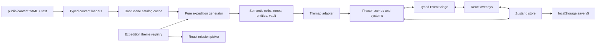

# Architecture

Starship Alexandria is a client-side desktop web game inside a Next.js application. React provides the accessible document interface; Phaser renders and presents the spatial world. A pure expedition domain sits between content and rendering so procedural behavior can be tested without a browser or canvas.

## System map



The arrows describe data flow, not import permission. In particular, the generator does not import Phaser, React, or Zustand.

## Runtime ownership

### React

React owns the parts of the experience that are documents rather than places:

- the launch and preference gate;
- destination selection;
- dialogue choices and explicit close controls;
- the library and reading view;
- the visual and textual maps;
- focus trapping, focus return, tabs, and keyboard behavior inside overlays;
- the ARIA live event log and other non-canvas equivalents.

The game canvas remains mounted behind these overlays. `GameContainer` marks the world inert while a modal is open so canvas input and background controls cannot compete with the active dialog.

### Phaser

Phaser owns the 1024×768 world and uses `FIT` scaling with centered, nearest-neighbor pixel art. Its three active scenes are:

- `BootScene`: preload local assets and typed content catalogs;
- `ShipScene`: present the Alexandria, its library terminal, and transporter;
- `ExploreScene`: render an expedition and coordinate FOV, movement, interactions, footsteps, and scene effects.

Phaser is a presentation and spatial-runtime layer. It must not decide persistent progression or parse narrative YAML.

### Zustand

Zustand owns progression, settings, and modal/game-phase state. Components select only the fields they need and invoke store actions instead of mutating nested state directly.

The store deliberately contains both durable and expedition-scoped data. The persistence boundary, not the TypeScript object shape, decides which values survive a reload.

### Event bridge and input

`src/game/EventBridge.ts` is the typed boundary for named React ↔ Phaser events. The browser-level keyboard listener first converts a key into a semantic action in `InputActionRouter`; the dispatcher then routes that action to React state or the game scene. Native HTML controls are excluded from global game input.

Subscribers must remove the exact listener they registered. This is important in development, where React Strict Mode mounts effects twice to reveal unsafe subscriptions.

## Expedition domain

The public entry point is `src/game/expeditions/index.ts`:

```ts
generateExpedition({
  seed,
  themeId,
  collectedFragmentIds,
  contentCatalog,
}): GeneratedExpedition
```

`contentCatalog` is optional; the included registry supplies defaults. The result includes:

```ts
type GeneratedExpedition = {
  seed: string;
  themeId: ThemeId;
  topology: TopologyKind;
  width: number;
  height: number;
  cells: SemanticCell[][];
  zones: Zone[];
  spawn: Point;
  extraction: Point;
  entities: PlacedEntity[];
  vault: PlacedVault;
  generation: {
    attempts: number;
    usedFallback: boolean;
  };
};
```

Each semantic cell records terrain, walkability, opacity, footstep surface, render role, and zone ID. Game rules consume those meanings; an atlas only decides how a meaning looks.

The generator owns topology, zones, spawn/extraction, NPCs, fragments, journals, batteries, the map pickup, props, clue/vault pairing, and vault reward. It is synchronous and performs no I/O.

### Determinism

All generation decisions use seeded random substreams for layout, content, NPCs, vaults, and decoration. A content-catalog change can change which excerpt appears without moving the vault or rebuilding the topology. rot.js exposes a singleton RNG, so `withRotSeed` saves and restores both its seed and state around map-building calls.

Generation validates each candidate and retries deterministically up to 20 times. If no candidate satisfies the contract, it uses a small theme-specific fallback layout. The result records whether that fallback was necessary.

Never use `Math.random()` or wall-clock time inside `src/game/expeditions/`. Create another named `SeededRandom` stream if a new concern must vary independently.

### Theme topology contracts

| Theme ID | Generator contract |
| --- | --- |
| `scriptorium` | rot.js Digger rooms and corridors, including manuscript and stack zones |
| `cathedral` | custom cross-plan with nave, transepts, chapels, cloister, narthex, and crypt |
| `university` | rot.js-assisted academic rooms connected around a traversable courtyard loop |
| `gardens` | rot.js Cellular field with named clearings, connected paths, and a flooded pavilion |

The semantic adapter in `semanticTilemap.ts` converts this output to the compatibility shape used by Phaser systems. Rendering code should consume `renderRole` and `surface`; it should not infer collision or audio behavior from a tile-frame number.

## Content pipeline

`public/content/` is the only source of narrative data. The browser fetches its YAML and excerpt files from stable `/content/...` URLs; typed adapters turn them into game records. A root-level `content/` directory is forbidden because it would create a second, build-time-only truth.

`scripts/validate-content.js` checks required fields, unique IDs, text paths, source metadata, allowed theme IDs, one vault and two NPCs per theme, and Project Gutenberg boilerplate. The production build runs content validation first.

See [Content authoring](CONTENT_AUTHORING.md) for exact schemas and [Theme authoring](THEME_AUTHORING.md) for registry wiring.

## Save v5

The Zustand persistence key is `starship-alexandria-save`; schema version 5 stores only:

- player identity, flashlight charge, and spare-battery count;
- collected fragment IDs;
- visited maps, discovered NPCs, read non-vault journals, and collected artifacts;
- whether the narrative welcome has been seen;
- narration, SFX, ambience, master-volume, and motion preferences;
- the previously selected destination.

It does not store excerpt bodies, player coordinates, an active procedural map, modal state, or an expedition clue. On hydration, every historical save shape migrates to v5 and the player safely returns to the ship. After content loads, fragment IDs are resolved against the canonical catalog; unknown IDs are ignored.

Vault clues are scoped to the active expedition and vault ID. They are never migrated into durable journal progress, so one discovered combination cannot unlock a future vault.

This refresh intentionally has no mid-expedition resume.

## Audio and motion policy

Every page load begins behind an HTML launch gate. Content and core assets must be ready before its Begin button is enabled. The click supplies the fresh browser gesture needed to unlock audio; neither a local clip, browser speech synthesis, nor Phaser audio may play before it.

Narration and game sound are coordinated but distinct:

- Phaser owns local SFX, footsteps, and ambience;
- browser narration owns recorded opening lines and optional speech synthesis;
- settings and the global audio lock gate both systems;
- footsteps occur only after a successful move and use the destination cell's semantic surface;
- hidden pages pause ambience;
- reduced-motion behavior is shared by CSS and Phaser through `system | reduce | full`.

Recorded opening clips remain local and list model, voice, source-text hash, and path in `public/audio/voices/manifest.json`. The UI visibly identifies them as AI-generated.

## Accessibility boundary

Canvas pixels are never the sole carrier of essential information. The HTML layer supplies:

- a focusable game-controls region and centralized keyboard routing;
- modal focus trap and return, inert backgrounds, and explicit Close buttons;
- ARIA live updates for movement, discoveries, and status;
- semantic tabs and tab panels in the ship library;
- a textual map with current location, discovered zones, approximate direction/distance, and known contents;
- visible equivalents for sound cues and motion-free alternatives for effects.

Automated accessibility checks are useful but incomplete. The browser suite runs axe against the major overlays; the release checklist also includes a documented keyboard-only screen-reader pass.

## Testing layers

| Layer | What it protects |
| --- | --- |
| Vitest unit tests | pure movement/interaction results, RNG behavior, migrations, loaders, audio gate, input routing |
| Generator fuzz tests | 250 seeds per theme: dimensions, topology, reachability, collisions, placement counts, references, clue/vault access, retry bounds |
| Integration tests | store/content boundaries, strict subscription cleanup, content/assets validation |
| Playwright | launch/settings, all seeded themes, keyboard movement/interactions, persistence, focus, reduced motion, textual map, and failure/retry paths |
| Visual snapshots | stable ship, picker, destination, map, and reader states at desktop sizes and HTML overlays at 200% zoom |

Playwright derives routes through the semantic map with BFS and sends real keyboard input; it does not warp the player or depend on fixed sleeps. Development E2E builds may expose a read-only `window.__STARSHIP_E2E__` snapshot. The adapter must be absent unless the E2E build flag is enabled and must never ship in production.

### Manual keyboard and VoiceOver pass

Automated checks cannot judge whether the canvas/HTML handoff forms a coherent screen-reader experience. Before a showcase release, test a production build in Safari with macOS VoiceOver, using a temporary browser profile or known fixture save:

1. Traverse the launch gate without a pointer. Confirm its premise, loading status, audio settings, motion radio group, and disabled/enabled Begin state are announced in a sensible order.
2. Turn in-game narration off for one pass so VoiceOver and browser speech do not talk over one another. Begin, confirm focus moves to the game-controls region, and request the `I` status summary.
3. From the ship, open the destination picker with the keyboard. Read all four destination cards, choose one, and confirm the transition is announced once.
4. Move, encounter a blocked tile, collect the area map, speak to an NPC, read a journal and excerpt, discover the expedition clue, open its vault, and return to extraction without using a pointer.
5. Open the textual map with `M`. Confirm current zone, discovered zones, approximate directions/distances, known contents, and the return route are understandable without the canvas.
6. At each dialogue, map, reader, mission picker, and settings view, verify focus enters the overlay, stays inside it, and returns to the invoking control/region after Close or `Escape`.
7. Repeat the launch and one full interaction with narration on; confirm AI-voice disclosure is present and no audio begins before Begin.
8. Repeat the major overlays at 200% browser zoom and with Reduce Motion enabled. Check that text is not clipped, focus remains visible, and motion-free state changes carry the same information.

Record the date, macOS/Safari versions, input commands used, save/seed, failures, and any intentionally deferred issue in the release notes. A pass is incomplete if essential state is available only through canvas position, color, animation, or sound.

Run the complete local gate with:

```bash
npm run check
npm run test:e2e
```
